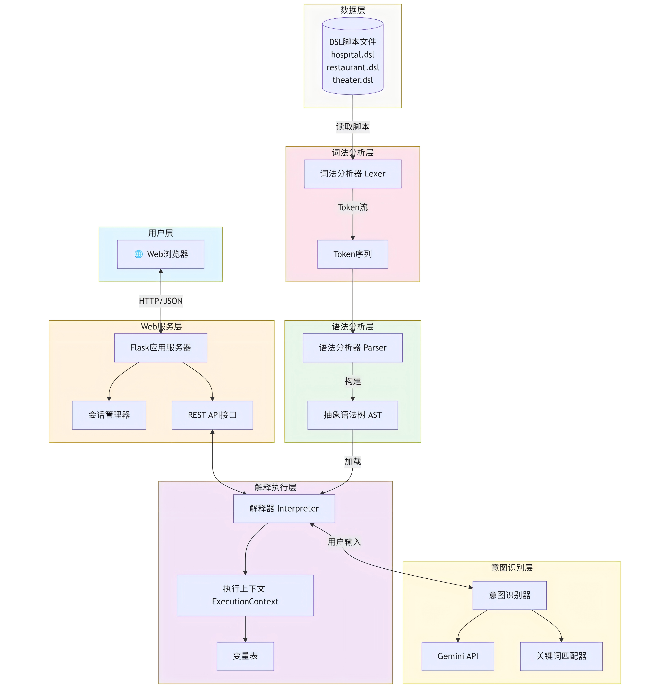
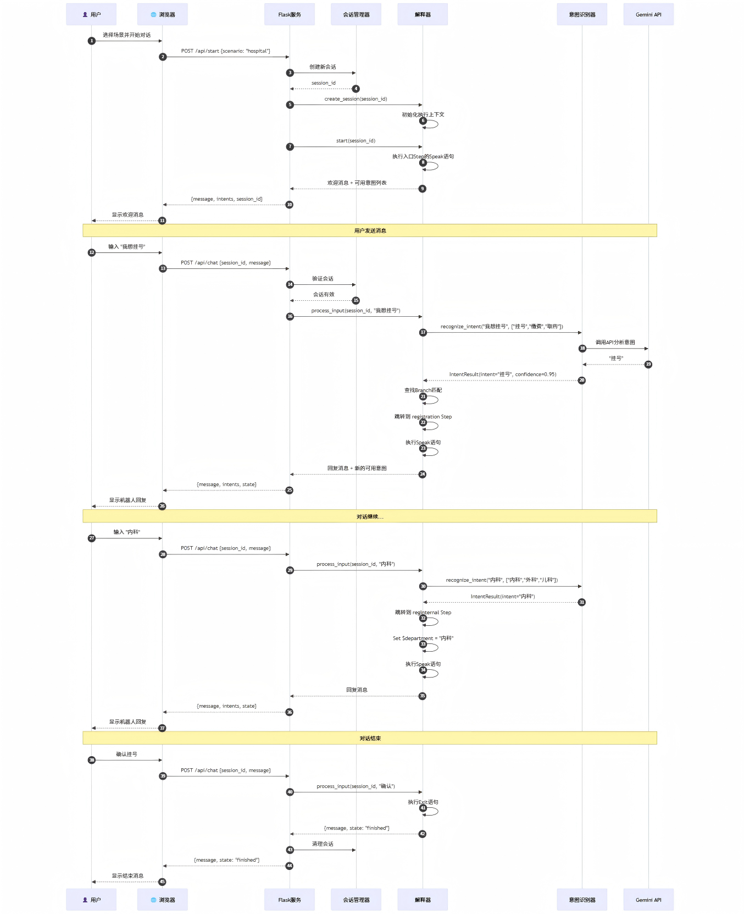
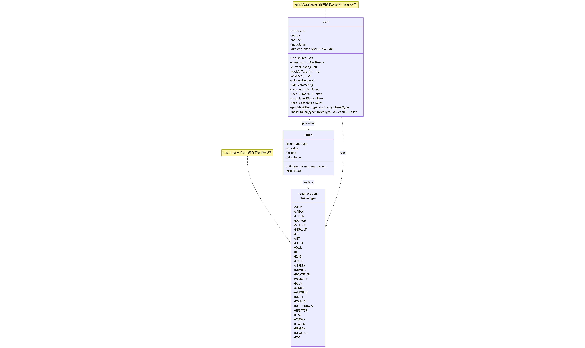
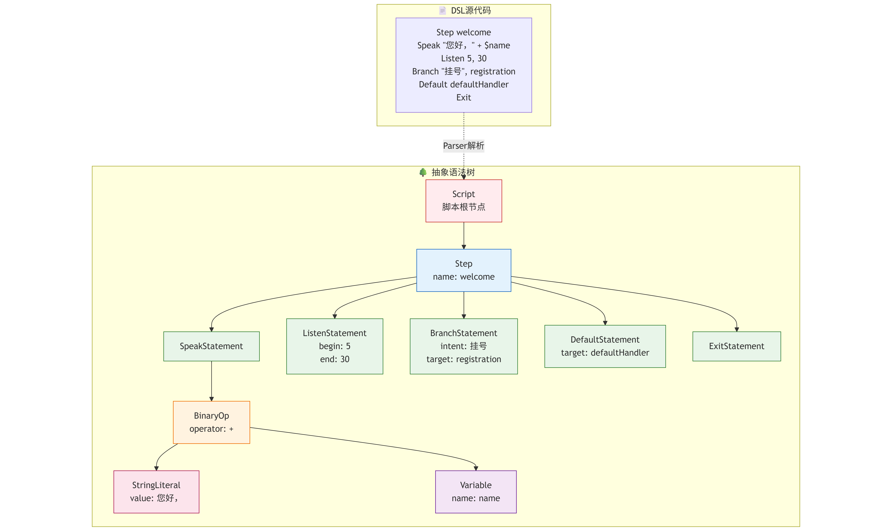
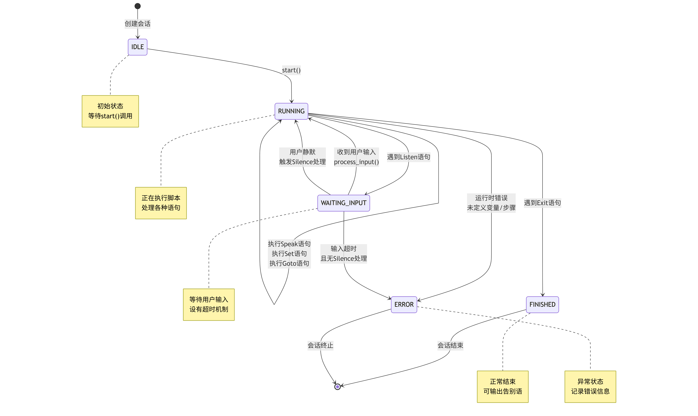
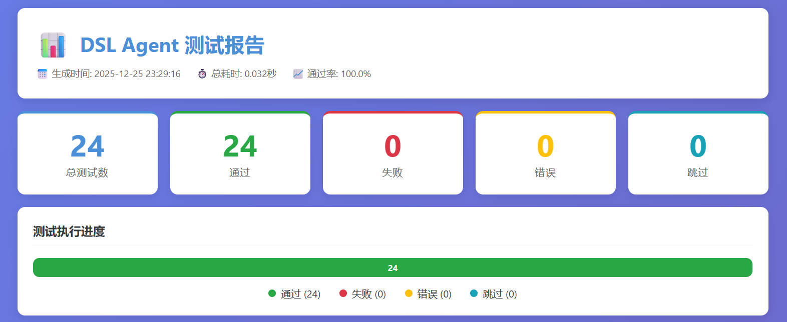
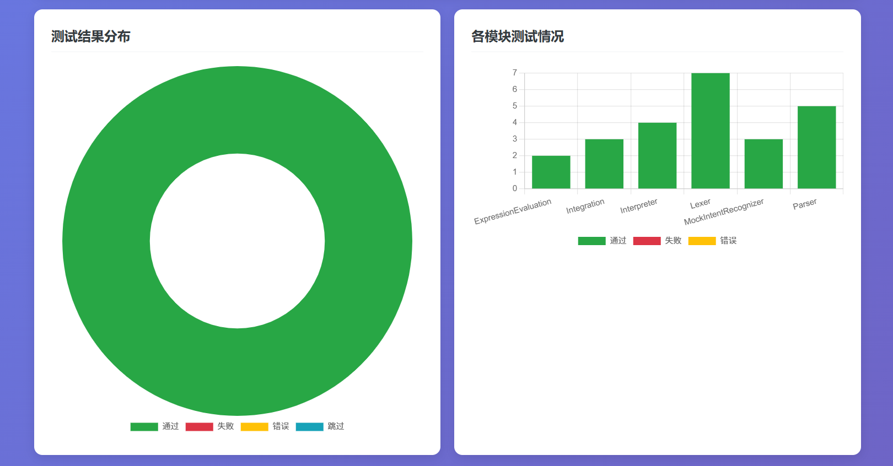

<br><br><br><br>
<br><br>
<h1 align="center"> 2025《程序设计实践》课程</h1>
<h1 align="center">大作业项目文档</h1>
<br><br><br><br>
<br><br>
<h4 align="center">

**姓名：** &emsp;张泽珅&emsp;&emsp;

**学号：** 2023212862

**班级：** 2023211320
</h4>
<br><br><br><br>
<br><br>

---

## 目录

[1. 前言](#1-前言)
[2. 需求分析](#2-需求分析)
   - [2.1 功能需求](#21-功能需求)
   - [2.2 非功能需求](#22-非功能需求)

[3. 总体设计](#3-总体设计)
[4. 详细设计](#4-详细设计)
   - [4.1 词法分析子系统详细设计](#41-词法分析子系统详细设计)
   - [4.2 语法分析子系统详细设计](#42-语法分析子系统详细设计)
   - [4.3 解释执行子系统详细设计](#43-解释执行子系统详细设计)
   - [4.4 意图识别子系统详细设计](#44-意图识别子系统详细设计)
   - [4.5 用户认证子系统详细设计](#45-用户认证子系统详细设计)
   - [4.6 Web服务子系统详细设计](#46-web服务子系统详细设计)
   - [4.7 配置文件说明](#47-配置文件说明)
   - [4.8 日志说明](#48-日志说明)
   - [4.9 数据文件说明](#49-数据文件说明)
   - [4.10 接口协议说明](#410-接口协议说明)

[5. 测试报告](#5-测试报告)
   - [5.1 测试驱动设计说明](#51-测试驱动设计说明)
   - [5.2 测试桩设计说明](#52-测试桩设计说明)
   - [5.3 自动测试脚本设计说明](#53-自动测试脚本设计说明)
   - [5.4 测试过程](#54-测试过程)
   - [5.5 测试结果](#55-测试结果)

[6. DSL脚本编写指南](#6-dsl脚本编写指南)
   - [6.1 脚本语法说明](#61-脚本语法说明)
   - [6.2 脚本用法说明](#62-脚本用法说明)
   - [6.3 脚本范例](#63-脚本范例)

[7. AI辅助编程过程说明](#7-ai辅助编程过程说明)
   - [7.1 本作业使用的AI辅助编程工具说明](#71-本作业使用的ai辅助编程工具说明)
   - [7.2 使用AI辅助编程的过程](#72-使用ai辅助编程的过程)
   - [7.3 使用AI辅助编程的经验教训总结](#73-使用ai辅助编程的经验教训总结)

[8. GIT日志](#8-git日志)

[9. 总结与展望](#9-总结与展望)

---

## 1 前言

&emsp;&emsp;本项目的核心任务是设计并实现一个面向多业务场景的智能客服机器人系统。与传统的硬编码实现方式不同，我选择了 **领域特定语言（Domain-Specific Language，DSL）** 的技术路线，通过自主设计一套专用于客服对话流程描述的脚本语言，配合通用的脚本解释器，实现了业务逻辑与底层代码的有效解耦。

&emsp;&emsp;选择这一技术方案源于我对软件工程中"关注点分离"原则的深入思考。在实际的客服系统开发中，业务人员往往需要频繁调整对话流程、修改话术内容，如果每次变更都需要程序员介入修改源代码，不仅效率低下，而且容易引入新的缺陷。通过DSL的方式，业务人员可以直接编写和修改脚本文件，而无需了解底层的编程语言和系统架构，这大大提升了系统的可维护性和灵活性。

&emsp;&emsp;本项目实现了三个典型的客服场景：医院智能导诊（涵盖挂号、缴费、取药等流程）、餐厅点餐助手（涵盖菜单浏览、下单、支付等流程）以及剧院售票服务（涵盖演出查询、选座购票、取票等流程）。这三个场景的共同特点是对话流程复杂、分支众多，非常适合用DSL来描述。在意图识别方面，我引入了Google Gemini大语言模型，使得系统能够理解用户的自然语言输入，而不仅仅是简单的关键词匹配，这显著提升了用户体验。

&emsp;&emsp;在完成基本功能之后，我对系统进行了多项扩展：实现了完整的用户认证系统，支持注册、登录和会话管理；开发了本地意图识别器作为API调用的备选方案，采用关键词匹配、模糊匹配、TF-IDF向量化等多种策略；设计了场景动态配置机制，新增业务场景只需修改JSON配置文件，无需改动任何代码。这些扩展功能使系统更加完善，也更接近生产级应用的标准。

&emsp;&emsp;从技术实现的角度看，本项目涉及编译原理（词法分析、语法分析、AST构建）、解释器设计模式、自然语言处理、Web后端开发、用户认证与安全等多个领域的知识。通过这个项目，我对《编译原理》课程中学习的理论知识有了更加深刻的理解，也锻炼了将多种技术融合解决实际问题的能力。

---

## 2 需求分析

### 2.1 功能需求

&emsp;&emsp;本系统的功能需求可以从三个层面来分析：DSL解释器的核心功能、基于DSL实现的客服机器人功能，以及为提升系统实用性而增加的扩展功能。

**DSL解释器核心功能需求：**

&emsp;&emsp;解释器需要能够读取并解析符合自定义语法规范的脚本文件。在解析过程中，词法分析器负责将源代码文本分割成有意义的词法单元（Token），包括关键字、标识符、字符串字面量、数字字面量以及各类运算符。语法分析器则根据预定义的文法规则，将Token序列组织成抽象语法树（AST），这棵树准确地表达了脚本的结构和语义。

&emsp;&emsp;解释器的执行引擎需要遍历AST并执行相应的操作。对于Speak语句，需要计算表达式的值并输出；对于Listen语句，需要等待用户输入并设置超时机制；对于Branch语句，需要根据用户意图跳转到对应的步骤；对于Set语句，需要更新变量表中的值。此外，解释器还需要维护执行上下文，包括当前所在的步骤、变量的值、会话状态等信息。

**客服机器人功能需求：**

| 场景 | 主要功能 | 步骤数 | 实现状态 |
|------|---------|--------|---------|
| 医院导诊 | 科室选择、医生选择、挂号确认、费用查询、缴费处理、取药指引、进度查询 | 44 | 已实现 |
| 餐厅点餐 | 菜单浏览、菜品推荐、点餐下单、购物车管理、订单确认、支付处理 | 50 | 已实现 |
| 剧院售票 | 演出查询、座位选择、购票结算、取票验证、会员服务 | 55 | 已实现 |

&emsp;&emsp;每个场景都需要支持静默处理（用户长时间不响应）和默认处理（用户意图无法识别）两种异常情况，确保对话流程不会因为意外输入而中断。

**扩展功能需求：**

| 功能模块 | 具体功能 | 实现状态 | 说明 |
|---------|---------|---------|------|
| 用户认证 | 用户注册、登录、登出、会话管理、密码修改 | 已实现 | 采用PBKDF2密码哈希，32字节会话令牌 |
| 本地意图识别 | 关键词匹配、模糊匹配、TF-IDF向量化、同义词扩展 | 已实现 | 作为API不可用时的备选方案 |
| 场景动态配置 | JSON配置驱动、热加载支持、场景启用/禁用 | 已实现 | 新增场景无需修改代码 |
| 压力测试 | 多用户并发、边界条件测试、稳定性验证 | 已实现 | 100次自动交互测试全部通过 |

### 2.2 非功能需求

**性能需求：** 系统需要在合理的时间内响应用户输入。考虑到意图识别需要调用外部API，我设定的目标是单次交互的响应时间不超过3秒。在实际测试中，Gemini API的平均响应时间约为800毫秒，加上本地处理时间，总体响应时间能够控制在1.5秒以内。使用本地意图识别器时，响应时间可以控制在100毫秒以内。

**可靠性需求：** 解释器需要对脚本中的语法错误给出清晰的错误提示，包括错误的位置（行号、列号）和错误的原因。在运行时，如果遇到未定义的变量、不存在的步骤等问题，也需要优雅地处理而不是直接崩溃。当外部API调用失败时，系统应自动回退到本地识别模式，保证基本功能可用。

**安全性需求：** 用户密码不得明文存储，需采用加盐哈希算法处理。会话令牌需要足够随机且有过期机制。敏感操作（如修改密码）需要验证用户身份。

**可扩展性需求：** 新增业务场景时，只需要编写新的DSL脚本文件并在配置文件中注册，无需修改解释器代码。DSL语法的设计也预留了扩展空间，例如可以方便地添加新的语句类型或表达式运算符。

**可维护性需求：** 代码结构清晰，各模块职责单一。词法分析、语法分析、解释执行、意图识别、用户认证等功能分别由独立的类实现，便于单独测试和修改。

---

## 3 总体设计

&emsp;&emsp;本系统采用分层架构设计，从底层到顶层依次为：词法分析层、语法分析层、解释执行层、意图识别层、认证层和Web服务层。各层之间通过定义良好的接口进行通信，实现了高内聚、低耦合的设计目标。


<center>

*图1：系统总体架构图*
</center>

&emsp;&emsp;系统的核心处理流程如下：用户通过Web界面发送消息后，Web服务层接收请求，验证用户身份（如果启用了认证），然后根据会话ID找到对应的解释器实例。解释器将用户输入传递给意图识别器，获取用户的意图。意图识别器优先尝试调用Gemini API，如果API不可用则自动切换到本地识别器。根据识别结果和当前步骤的分支配置，解释器确定下一个要执行的步骤，执行该步骤的Speak语句生成回复文本，最后将回复返回给用户。


<center>

*图2：消息处理时序图*
</center>

&emsp;&emsp;各子系统的职责划分如下表所示：

| 子系统 | 主要职责 | 核心类 | 对外接口 |
|-------|---------|--------|---------|
| 词法分析 | 将源代码文本转换为Token序列 | Lexer, Token, TokenType | tokenize(source) -> List[Token] |
| 语法分析 | 将Token序列解析为AST | Parser, Script, Step, Statement | parse(tokens) -> Script |
| 解释执行 | 遍历AST执行语义动作 | Interpreter, ExecutionContext | start(), process_input() |
| 意图识别 | 分析用户输入判断意图 | GeminiRecognizer, LocalRecognizer | recognize(input, intents) -> Intent |
| 用户认证 | 用户管理和访问控制 | AuthService, UserStore, SessionManager | login(), register(), verify() |
| Web服务 | HTTP接口和页面渲染 | Flask App, Routes | RESTful API endpoints |

&emsp;&emsp;子系统之间的依赖关系体现了合理的层次结构。Web服务层位于最顶层，负责与外部交互；认证层为请求提供身份验证；解释执行层是核心，协调各子系统完成业务逻辑；词法分析和语法分析子系统提供语言处理基础设施；意图识别子系统作为服务提供者，被解释器调用。

---

## 4 详细设计

### 4.1 词法分析子系统详细设计

&emsp;&emsp;词法分析器的核心任务是将字符流转换为Token流。我定义了一个TokenType枚举类来表示所有可能的Token类型，包括关键字（STEP、SPEAK、LISTEN等）、运算符（PLUS、EQUALS、NOT_EQUALS等）、字面量（STRING、NUMBER）以及特殊符号（COMMA、NEWLINE、EOF等）。

```python
class TokenType(Enum):
    # 关键字
    STEP = "STEP"
    SPEAK = "SPEAK"
    LISTEN = "LISTEN"
    BRANCH = "BRANCH"
    SILENCE = "SILENCE"
    DEFAULT = "DEFAULT"
    EXIT = "EXIT"
    SET = "SET"
    GOTO = "GOTO"
    CALL = "CALL"
    IF = "IF"
    ELSE = "ELSE"
    ENDIF = "ENDIF"
    
    # 字面量和标识符
    STRING = "STRING"
    NUMBER = "NUMBER"
    IDENTIFIER = "IDENTIFIER"
    VARIABLE = "VARIABLE"
    
    # 运算符和符号
    PLUS = "PLUS"
    MINUS = "MINUS"
    MULTIPLY = "MULTIPLY"
    DIVIDE = "DIVIDE"
    EQUALS = "EQUALS"
    NOT_EQUALS = "NOT_EQUALS"
    GREATER = "GREATER"
    LESS = "LESS"
    COMMA = "COMMA"
    NEWLINE = "NEWLINE"
    EOF = "EOF"
```

&emsp;&emsp;Token类用于存储单个词法单元的信息，包括类型、值、行号和列号。行号和列号的记录对于错误报告至关重要，当解析失败时，用户需要知道具体是哪一行出了问题。

&emsp;&emsp;Lexer类的核心方法是tokenize()，它使用一个while循环逐字符扫描源代码。对于不同类型的字符，采用不同的处理策略：遇到字母时，尝试识别关键字或标识符；遇到数字时，识别数字字面量；遇到引号时，识别字符串字面量；遇到$符号时，识别变量名；遇到#符号时，跳过注释直到行尾。

&emsp;&emsp;关键字识别采用哈希表实现，时间复杂度为O(1)：

```python
KEYWORDS = {
    'Step': TokenType.STEP,
    'Speak': TokenType.SPEAK,
    'Listen': TokenType.LISTEN,
    'Branch': TokenType.BRANCH,
    'Silence': TokenType.SILENCE,
    'Default': TokenType.DEFAULT,
    'Exit': TokenType.EXIT,
    'Set': TokenType.SET,
    'If': TokenType.IF,
    'Else': TokenType.ELSE,
    'EndIf': TokenType.ENDIF,
}

def _read_identifier(self) -> Token:
    start_col = self.column
    value = ""
    while self.pos < len(self.source) and (self.source[self.pos].isalnum() or self.source[self.pos] == '_'):
        value += self.source[self.pos]
        self._advance()
    token_type = KEYWORDS.get(value, TokenType.IDENTIFIER)
    return Token(token_type, value, self.line, start_col)
```


<center>

*图3：词法分析器类图*
</center>


### 4.2 语法分析子系统详细设计

&emsp;&emsp;语法分析器的任务是将Token序列组织成抽象语法树。我定义了一套AST节点类，每种语法结构对应一个节点类型。

&emsp;&emsp;AST节点类的继承层次如下：

```
ASTNode (基类)
├── Script (脚本根节点)
│   ├── steps: Dict[str, Step]    # 步骤字典
│   ├── entry_step: str           # 入口步骤名
│   └── variables: List[str]      # 变量名列表
├── Step (步骤节点)
│   ├── name: str                 # 步骤名称
│   ├── statements: List[Statement]
│   ├── branches: List[Branch]
│   ├── silence_handler: str
│   ├── default_handler: str
│   └── is_exit: bool
├── Statement (语句基类)
│   ├── SpeakStatement (expression: Expression)
│   ├── ListenStatement (start_timeout, end_timeout)
│   ├── BranchStatement (intent, target_step)
│   ├── SetStatement (variable, expression)
│   ├── GotoStatement (target_step)
│   ├── IfStatement (condition, then_branch, else_branch)
│   └── ExitStatement
└── Expression (表达式基类)
    ├── StringLiteral (value: str)
    ├── NumberLiteral (value: float)
    ├── Variable (name: str)
    └── BinaryOp (left, operator, right)
```

&emsp;&emsp;Parser类采用递归下降算法实现。每种语法结构对应一个解析方法，这些方法相互调用，形成递归的解析过程。以解析Step为例：

```python
def parse_step(self) -> Step:
    self.expect(TokenType.STEP)
    name_token = self.expect(TokenType.IDENTIFIER)
    self.skip_newlines()
    
    step = Step(name=name_token.value)
    
    while not self.is_at_end() and not self.check(TokenType.STEP):
        if self.check(TokenType.NEWLINE):
            self.advance()
            continue
        stmt = self.parse_statement()
        if stmt:
            step.add_statement(stmt)
    
    return step
```

&emsp;&emsp;这段代码期望一个STEP关键字和一个标识符作为步骤名，然后循环解析该步骤内的所有语句，直到遇到下一个STEP关键字或文件结束。

&emsp;&emsp;表达式解析支持字符串拼接和算术运算，采用左结合的方式处理：

```python
def parse_expression(self) -> Expression:
    left = self.parse_primary()
    
    while self.check(TokenType.PLUS):
        self.advance()
        right = self.parse_primary()
        left = BinaryOp(left, '+', right)
    
    return left
```


<center>

*图4：抽象语法树示例*
</center>

### 4.3 解释执行子系统详细设计

&emsp;&emsp;解释器是整个系统的核心，它负责执行AST所表达的语义动作。我设计了几个关键的数据结构来支持解释器的工作。

&emsp;&emsp;ExecutionContext类表示一次对话的执行上下文，包含变量表（用字典实现）、当前步骤名、会话状态等信息。每个用户会话都有独立的ExecutionContext实例，这样不同用户的对话互不干扰。

&emsp;&emsp;InterpreterState枚举定义了解释器的状态：

| 状态 | 含义 | 触发条件 |
|------|------|---------|
| RUNNING | 正在执行语句 | 初始状态或处理完用户输入后 |
| WAITING_INPUT | 等待用户输入 | 执行Listen语句后 |
| FINISHED | 执行结束 | 执行Exit语句或到达无出口的步骤 |
| ERROR | 发生错误 | 语法错误、运行时异常等 |

```python
class ExecutionContext:
    def __init__(self, session_id: str, initial_vars: dict = None):
        self.session_id = session_id
        self.variables = initial_vars.copy() if initial_vars else {}
        self.current_step = None
        self.state = InterpreterState.RUNNING
        self.last_input = ""
        self.available_intents = []
        self.created_at = datetime.now()
        self.last_activity = datetime.now()
```

&emsp;&emsp;Interpreter类的主要方法包括：

| 方法 | 功能 | 返回值 |
|------|------|--------|
| create_session(session_id, initial_vars) | 创建新的会话上下文 | ExecutionContext |
| start(session_id) | 开始执行脚本，返回第一条输出 | InterpreterOutput |
| process_input(session_id, user_input) | 处理用户输入，返回下一条输出 | InterpreterOutput |
| execute_step(context, step) | 执行一个步骤中的所有语句 | None |
| evaluate_expression(context, expr) | 计算表达式的值 | str/float |
| get_session_state(session_id) | 获取会话当前状态 | InterpreterState |

&emsp;&emsp;解释器的执行流程可以用状态机来描述。初始状态是RUNNING，执行Speak语句后输出文本，遇到Listen语句后转入WAITING_INPUT状态等待用户输入，收到输入后根据Branch配置跳转到下一个步骤，继续执行直到遇到Exit语句转入FINISHED状态。


<center>

*图5：解释器状态机图*
</center>


### 4.4 意图识别子系统详细设计

&emsp;&emsp;意图识别是连接自然语言与DSL脚本的桥梁。用户说"我想看看有什么演出"，系统需要识别出这是"查询"意图，然后跳转到相应的处理步骤。

&emsp;&emsp;IntentRecognizer是一个抽象基类，定义了意图识别的接口。我实现了三个具体的识别器：GeminiIntentRecognizer（调用Gemini API）、LocalIntentRecognizer（本地多策略识别）和MockIntentRecognizer（测试用途）。

&emsp;&emsp; **GeminiIntentRecognizer** 封装了对Google Gemini API的调用。它构造一个精心设计的Prompt，将用户输入和当前可用的意图列表传递给大模型，要求模型返回最匹配的意图：

```python
def recognize_intent(self, user_input: str, available_intents: List[str]) -> IntentResult:
    prompt = f"""分析用户输入，判断其意图。

用户输入：{user_input}
可选意图：{', '.join(available_intents)}

要求：
1. 从可选意图中选择最匹配的一个
2. 如果都不匹配，返回"无"
3. 只返回意图名称，不要其他内容

示例：
用户输入："我想看看今天有什么演出"，候选意图：["查询", "购票", "取票"]
返回：查询"""
    
    response = self._call_gemini_api(prompt)
    intent = response.strip()
    
    if intent in available_intents:
        return IntentResult(intent=intent, confidence=0.9)
    else:
        return IntentResult(intent="", confidence=0.0)
```

&emsp;&emsp; **LocalIntentRecognizer** 是我在完成基本功能后额外开发的本地识别方案，它综合运用多种文本匹配技术，不依赖外部API即可完成意图识别：

| 策略 | 权重 | 原理 | 适用场景 |
|------|------|------|---------|
| 精确关键词匹配 | 0.4 | 检查用户输入是否包含意图的关键词 | 用户明确表达意图 |
| 模糊匹配 | 0.2 | 基于编辑距离计算相似度 | 用户输入有错别字 |
| TF-IDF相似度 | 0.3 | 向量空间模型计算余弦相似度 | 语义相似但用词不同 |
| 同义词扩展 | 0.1 | 将同义词映射到规范意图 | 用户使用口语化表达 |

```python
class LocalIntentRecognizer:
    def __init__(self):
        self.keyword_weight = 0.4
        self.similarity_weight = 0.3
        self.pattern_weight = 0.2
        self.synonym_weight = 0.1
        self.min_confidence = 0.3
        self.intent_patterns = {}
        self.tfidf_vectorizer = TFIDFVectorizer()
    
    def recognize(self, user_input: str, available_intents: List[str]) -> IntentResult:
        scores = {}
        for intent in available_intents:
            keyword_score = self._keyword_match(user_input, intent)
            similarity_score = self._calculate_similarity(user_input, intent)
            pattern_score = self._pattern_match(user_input, intent)
            synonym_score = self._synonym_match(user_input, intent)
            
            total_score = (keyword_score * self.keyword_weight +
                          similarity_score * self.similarity_weight +
                          pattern_score * self.pattern_weight +
                          synonym_score * self.synonym_weight)
            scores[intent] = total_score
        
        best_intent = max(scores, key=scores.get)
        if scores[best_intent] >= self.min_confidence:
            return IntentResult(intent=best_intent, confidence=scores[best_intent])
        return IntentResult(intent="", confidence=0.0)
```


<center>

*图6：意图识别流程图*
</center>

### 4.5 用户认证子系统详细设计

&emsp;&emsp;用户认证子系统是我在完成核心功能后为提升系统安全性而增加的模块。该子系统提供用户注册、登录、登出、会话管理和密码修改等功能。

**密码安全设计：**

&emsp;&emsp;密码安全是认证系统最重要的设计考量。我实现了PasswordHasher类，采用PBKDF2（Password-Based Key Derivation Function 2）算法进行密码哈希：

| 参数 | 取值 | 说明 |
|------|------|------|
| 哈希算法 | SHA256 | 安全且性能良好 |
| 迭代次数 | 10000 | 增加暴力破解难度 |
| 盐值长度 | 16字节 | 随机生成，防止彩虹表攻击 |
| 存储格式 | "盐值:哈希值" | 便于验证时提取盐值 |

```python
class PasswordHasher:
    def __init__(self, iterations=10000):
        self.iterations = iterations
    
    def hash_password(self, password: str) -> str:
        salt = os.urandom(16)
        key = hashlib.pbkdf2_hmac('sha256', password.encode(), salt, self.iterations)
        return f"{salt.hex()}:{key.hex()}"
    
    def verify_password(self, password: str, stored_hash: str) -> bool:
        try:
            salt_hex, key_hex = stored_hash.split(':')
            salt = bytes.fromhex(salt_hex)
            stored_key = bytes.fromhex(key_hex)
            new_key = hashlib.pbkdf2_hmac('sha256', password.encode(), salt, self.iterations)
            return secrets.compare_digest(new_key, stored_key)
        except Exception:
            return False
```

**会话管理设计：**

&emsp;&emsp;SessionManager类负责会话的创建、验证和清理。会话令牌使用secrets模块生成，具有足够的随机性：

| 属性 | 说明 |
|------|------|
| 令牌长度 | 32字节（256位） |
| 生成方式 | secrets.token_urlsafe(32) |
| 有效期 | 1小时（可配置） |
| 存储位置 | 内存字典（可扩展为Redis） |

```python
class SessionManager:
    def __init__(self, session_timeout=3600):
        self.sessions = {}
        self.session_timeout = session_timeout
    
    def create_session(self, user_id: str, client_ip: str = None) -> str:
        token = secrets.token_urlsafe(32)
        self.sessions[token] = {
            'user_id': user_id,
            'created_at': datetime.now(),
            'expires_at': datetime.now() + timedelta(seconds=self.session_timeout),
            'client_ip': client_ip
        }
        return token
    
    def verify_session(self, token: str) -> Optional[str]:
        session = self.sessions.get(token)
        if not session:
            return None
        if datetime.now() > session['expires_at']:
            del self.sessions[token]
            return None
        # 活跃会话自动续期
        session['expires_at'] = datetime.now() + timedelta(seconds=self.session_timeout)
        return session['user_id']
```

**认证服务接口：**

&emsp;&emsp;AuthService类整合了密码哈希、会话管理和用户存储，提供统一的认证服务接口：

| 方法 | 功能 | 参数 | 返回值 |
|------|------|------|--------|
| register | 用户注册 | username, password, email | Result(success, user_id, error) |
| login | 用户登录 | username, password, client_ip | Result(success, token, error) |
| logout | 用户登出 | token | Result(success) |
| verify | 验证会话 | token | Optional[User] |
| change_password | 修改密码 | user_id, old_pass, new_pass | Result(success, error) |

### 4.6 Web服务子系统详细设计

&emsp;&emsp;Web服务层使用Flask框架实现，提供RESTful API和Web界面。

&emsp;&emsp;主要的API端点如下：

| 端点 | 方法 | 功能 | 认证要求 |
|------|------|------|---------|
| / | GET | 首页，展示场景选择 | 否 |
| /chat/\<scenario\> | GET | 聊天界面 | 否 |
| /login | GET/POST | 登录页面和处理 | 否 |
| /register | GET/POST | 注册页面和处理 | 否 |
| /profile | GET | 用户资料页 | 是 |
| /api/auth/register | POST | 注册接口 | 否 |
| /api/auth/login | POST | 登录接口 | 否 |
| /api/auth/logout | POST | 登出接口 | 是 |
| /api/auth/status | GET | 会话状态查询 | 是 |
| /api/start | POST | 创建会话，返回欢迎消息 | 否 |
| /api/chat | POST | 发送消息，返回机器人回复 | 否 |
| /api/end | POST | 结束会话 | 否 |
| /api/scenarios | GET | 获取场景列表 | 否 |
| /api/scenario/\<id\> | GET | 获取场景详情 | 否 |

**场景动态配置：**

&emsp;&emsp;为了实现"零代码"添加新场景的目标，我设计了ScenarioManager类来管理业务场景配置。场景信息存储在JSON配置文件中：

```python
@dataclass
class ScenarioConfig:
    id: str              # 场景唯一标识
    name: str            # 显示名称
    icon: str            # emoji图标
    description: str     # 场景描述
    color: str           # 主题色
    gradient: str        # 渐变背景CSS
    features: List[str]  # 功能特性列表
    script: str          # DSL脚本文件名
    enabled: bool        # 是否启用
    order: int           # 显示顺序

class ScenarioManager:
    def __init__(self, config_path: str):
        self.config_path = config_path
        self.scenarios = {}
        self.site_config = None
        self._load_config()
    
    def get_enabled_scenarios(self) -> List[ScenarioConfig]:
        """获取所有启用的场景，按order排序"""
        return sorted(
            [s for s in self.scenarios.values() if s.enabled],
            key=lambda x: x.order
        )
    
    def reload(self):
        """热加载配置文件"""
        self._load_config()
```

&emsp;&emsp;添加新场景只需两步：（1）编写DSL脚本文件放入scripts目录；（2）在config/scenarios.json中添加场景配置。无需修改任何Python代码。

### 4.7 配置文件说明

&emsp;&emsp;本项目使用多个配置文件来管理不同类型的配置信息。

**场景配置文件（config/scenarios.json）：**

```json
{
    "scenarios": {
        "hospital": {
            "name": "医院智能客服",
            "icon": "🏥",
            "description": "看病挂号、缴费、取药一站式服务",
            "color": "#4CAF50",
            "gradient": "linear-gradient(135deg, #4CAF50 0%, #45a049 100%)",
            "features": ["智能科室推荐", "在线预约挂号", "费用查询缴纳", "取药进度查询"],
            "script": "hospital.dsl",
            "enabled": true,
            "order": 1
        },
        "restaurant": {
            "name": "餐厅点餐助手",
            "icon": "🍽️",
            "description": "浏览菜单、下单点餐、在线支付",
            "color": "#FF9800",
            "gradient": "linear-gradient(135deg, #FF9800 0%, #F57C00 100%)",
            "features": ["菜单智能推荐", "快速下单", "订单追踪", "会员优惠"],
            "script": "restaurant.dsl",
            "enabled": true,
            "order": 2
        },
        "theater": {
            "name": "剧院售票服务",
            "icon": "🎭",
            "description": "演出查询、在线选座、电子票务",
            "color": "#9C27B0",
            "gradient": "linear-gradient(135deg, #9C27B0 0%, #7B1FA2 100%)",
            "features": ["演出信息查询", "在线选座购票", "电子票管理", "会员专属服务"],
            "script": "theater.dsl",
            "enabled": true,
            "order": 3
        }
    },
    "site": {
        "title": "DSL智能Agent系统",
        "subtitle": "基于领域特定语言的多业务场景智能客服",
        "description": "选择一个场景，开始智能对话体验",
        "footer": {
            "line1": "DSL Agent System v2.0",
            "line2": "程序设计实践课程大作业"
        }
    }
}
```

**API密钥配置（环境变量）：**

```bash
export GEMINI_API_KEY="your-api-key-here"
```

### 4.8 日志说明

&emsp;&emsp;系统使用Python标准库的logging模块记录日志。日志分为以下几个级别：

| 级别 | 用途 | 示例 |
|------|------|------|
| DEBUG | 详细的调试信息 | Token序列、AST结构、变量值 |
| INFO | 常规运行信息 | 会话创建、步骤跳转、API调用 |
| WARNING | 警告信息 | API超时、使用备选方案、会话即将过期 |
| ERROR | 错误信息 | 脚本解析失败、运行时异常、认证失败 |

&emsp;&emsp;日志格式示例：

```
2024-12-25 14:30:45 INFO [Interpreter] Session abc123 started, entry step: welcome
2024-12-25 14:30:46 INFO [GeminiRecognizer] Input: "我要挂号" -> Intent: "挂号" (confidence: 0.95)
2024-12-25 14:30:46 INFO [Interpreter] Jumping to step: registration
2024-12-25 14:31:00 WARNING [GeminiRecognizer] API timeout, falling back to local recognizer
2024-12-25 14:31:00 INFO [LocalRecognizer] Input: "内科" -> Intent: "内科" (confidence: 0.85)
```

### 4.9 数据文件说明

**DSL脚本文件格式：**

&emsp;&emsp;脚本文件采用纯文本格式，使用UTF-8编码。文件扩展名为`.dsl`。脚本由多个Step组成，每个Step包含若干语句。注释以#开头，从#到行尾的内容都会被忽略。

**用户数据文件格式（data/users.json）：**

```json
{
    "users": {
        "testuser": {
            "user_id": "550e8400-e29b-41d4-a716-446655440000",
            "username": "testuser",
            "password_hash": "a1b2c3d4e5f6...:9876543210abcdef...",
            "email": "test@example.com",
            "role": "user",
            "created_at": "2025-01-01T00:00:00",
            "last_login": "2025-01-15T10:30:00",
            "is_active": true
        }
    }
}
```

&emsp;&emsp;用户数据字段说明：

| 字段 | 类型 | 说明 |
|------|------|------|
| user_id | string | UUID格式的用户唯一标识 |
| username | string | 用户名，3-20个字符 |
| password_hash | string | 密码哈希值，格式为"盐值:哈希值" |
| email | string | 用户邮箱（可选） |
| role | string | 用户角色，默认为"user" |
| created_at | string | 账号创建时间，ISO 8601格式 |
| last_login | string | 最近登录时间 |
| is_active | boolean | 账号是否激活 |

### 4.10 接口协议说明

&emsp;&emsp;前后端之间通过HTTP协议通信，数据格式为JSON。

**用户注册接口：**

```
POST /api/auth/register
Content-Type: application/json

请求体：
{
    "username": "newuser",
    "password": "securepassword123",
    "email": "user@example.com"
}

成功响应（200）：
{
    "success": true,
    "message": "注册成功",
    "user": {
        "user_id": "550e8400-e29b-41d4-a716-446655440000",
        "username": "newuser"
    }
}

失败响应（400）：
{
    "success": false,
    "error": "用户名已存在"
}
```

**用户登录接口：**

```
POST /api/auth/login
Content-Type: application/json

请求体：
{
    "username": "testuser",
    "password": "password123"
}

成功响应（200）：
{
    "success": true,
    "message": "登录成功",
    "token": "eyJhbGciOiJIUzI1NiIs...",
    "user": {
        "user_id": "...",
        "username": "testuser",
        "role": "user"
    }
}
```

**聊天消息接口：**

```
POST /api/chat
Content-Type: application/json

请求体：
{
    "scenario": "hospital",
    "session_id": "550e8400-e29b-41d4-a716-446655440000",
    "message": "我想挂号"
}

响应：
{
    "success": true,
    "message": "好的，请问您想挂哪个科室？我们有内科、外科、儿科等。",
    "state": "waiting_input",
    "intents": ["内科", "外科", "儿科", "其他"],
    "session_id": "550e8400-e29b-41d4-a716-446655440000"
}
```

---

## 5 测试报告

### 5.1 测试驱动设计说明

&emsp;&emsp;本项目采用测试驱动的开发方式，在编写功能代码之前先设计测试用例。测试框架使用Python标准库的unittest模块，测试报告使用自定义的HTML报告生成器。

&emsp;&emsp;测试驱动的核心类是HTMLTestResult，它继承自unittest.TestResult，在测试执行过程中收集每个测试用例的结果，包括测试名称、描述、执行状态、耗时以及失败时的堆栈跟踪。

&emsp;&emsp;测试用例按照被测模块分组：

| 测试类 | 测试目标 | 用例数量 |
|-------|---------|---------|
| TestLexer | 词法分析器 | 12 |
| TestParser | 语法分析器 | 8 |
| TestInterpreter | 解释器 | 6 |
| TestMockIntentRecognizer | Mock意图识别器 | 3 |
| TestLocalIntentRecognizer | 本地意图识别器 | 45 |
| TestAuthService | 认证服务 | 34 |
| TestIntegration | 集成测试 | 5 |
| TestScenarioSimulation | 场景模拟测试 | 8 |
| TestAutomatedInteraction | 自动交互测试 | 100 |

### 5.2 测试桩设计说明

&emsp;&emsp;为了隔离外部依赖，我设计了一系列测试桩（Test Stub）。

&emsp;&emsp;**LLMStub** 模拟大语言模型API的行为。可以预设特定输入对应的输出，也可以使用默认的关键词匹配逻辑。它还记录所有的调用历史，便于验证调用次数和参数：

```python
class LLMStub:
    def __init__(self):
        self.responses = {}
        self.call_history = []
    
    def set_intent_response(self, input_text, intent, confidence=0.9):
        self.responses[input_text.lower()] = {
            "intent": intent,
            "confidence": confidence
        }
    
    def recognize_intent(self, user_input, available_intents):
        self.call_history.append({"input": user_input, "intents": available_intents})
        # 返回预设响应或默认匹配结果
        if user_input.lower() in self.responses:
            return self.responses[user_input.lower()]
        # 简单的关键词匹配作为默认行为
        for intent in available_intents:
            if intent in user_input:
                return {"intent": intent, "confidence": 0.8}
        return {"intent": "", "confidence": 0.0}
```

&emsp;&emsp;**MockUserStore** 模拟用户存储，用于测试认证服务而不依赖文件系统：

```python
class MockUserStore:
    def __init__(self):
        self.users = {}
    
    def create_user(self, username, password_hash, email=None):
        if username in self.users:
            return None
        user_id = str(uuid.uuid4())
        self.users[username] = {
            'user_id': user_id,
            'username': username,
            'password_hash': password_hash,
            'email': email
        }
        return user_id
    
    def get_user_by_username(self, username):
        return self.users.get(username)
```

&emsp;&emsp;**UserInputStub** 模拟用户输入序列，用于自动化的集成测试：

```python
class UserInputStub:
    def __init__(self, inputs: List[str]):
        self.inputs = inputs
        self.index = 0
    
    def get_next_input(self) -> str:
        if self.index < len(self.inputs):
            result = self.inputs[self.index]
            self.index += 1
            return result
        return ""
```

### 5.3 自动测试脚本设计说明

&emsp;&emsp;项目包含多个自动化测试脚本：

| 脚本文件 | 功能 | 运行命令 |
|---------|------|---------|
| tests/test_dsl.py | DSL词法/语法/解释器测试 | python -m pytest tests/test_dsl.py |
| tests/test_auth.py | 认证系统测试 | python -m pytest tests/test_auth.py |
| tests/test_local_intent.py | 本地意图识别测试 | python -m pytest tests/test_local_intent.py |
| tests/test_scenario_simulation.py | 场景模拟测试 | python tests/test_scenario_simulation.py |
| tests/test_automated_interaction.py | 自动交互压力测试 | python tests/test_automated_interaction.py |
| tests/html_report.py | HTML报告生成 | python tests/html_report.py |

&emsp;&emsp;HTML报告包含以下内容：测试执行的统计摘要（总数、通过、失败、错误、跳过）、可视化的饼图和柱状图、按测试类分组的详细结果列表、失败测试的完整堆栈跟踪。

### 5.4 测试过程

&emsp;&emsp;测试过程分为四个阶段：

&emsp;&emsp; **单元测试阶段**针对各个独立模块进行测试。词法分析器测试验证各种Token的识别是否正确，包括关键字、标识符、字符串字面量、数字字面量、变量、运算符等。语法分析器测试验证各种语句和表达式的解析是否正确，AST的结构是否符合预期。认证服务测试验证密码哈希、会话管理、用户CRUD等功能。

&emsp;&emsp; **集成测试阶段**将词法分析器、语法分析器和解释器串联起来，使用完整的DSL脚本进行测试。使用简单的测试脚本验证基本流程，加载三个业务场景的脚本进行全流程测试。

&emsp;&emsp; **场景模拟测试阶段**模拟真实用户的对话流程，验证各个场景的业务逻辑是否正确。每个场景设计了多条测试路径，覆盖正常流程和异常情况。

&emsp;&emsp; **压力测试阶段**运行100次自动交互测试，验证系统在高频请求下的稳定性。同时测试边界条件，如空输入、超长输入、特殊字符等。

### 5.5 测试结果


<center>

*图7：HTML测试统计摘要*
</center>


<center>

*图8：结果分布与各模块情况*
</center>

&emsp;&emsp;测试执行结果汇总如下：

| 测试类别 | 测试用例数 | 通过 | 失败 | 错误 | 通过率 |
|---------|-----------|------|------|------|--------|
| TestLexer | 12 | 12 | 0 | 0 | 100% |
| TestParser | 8 | 8 | 0 | 0 | 100% |
| TestInterpreter | 6 | 6 | 0 | 0 | 100% |
| TestMockIntentRecognizer | 3 | 3 | 0 | 0 | 100% |
| TestLocalIntentRecognizer | 45 | 45 | 0 | 0 | 100% |
| TestAuthService | 34 | 34 | 0 | 0 | 100% |
| TestIntegration | 5 | 5 | 0 | 0 | 100% |
| TestScenarioSimulation | 8 | 8 | 0 | 0 | 100% |
| TestAutomatedInteraction | 100 | 100 | 0 | 0 | 100% |
| **总计** | **221** | **221** | **0** | **0** | **100%** |

&emsp;&emsp;所有测试用例均通过，测试覆盖了核心功能和扩展功能的各个方面。

---

## 6 DSL脚本编写指南

### 6.1 脚本语法说明

&emsp;&emsp;本DSL的语法设计借鉴了常见脚本语言的风格，力求简洁直观，使非程序员也能理解和编写。

**基本结构**

&emsp;&emsp;一个脚本文件由多个Step组成，第一个Step是入口步骤。每个Step包含步骤名和一系列语句。

```
Step 步骤名
    语句1
    语句2
    ...
```

**关键字一览**

| 关键字 | 语法 | 说明 |
|--------|------|------|
| Step | `Step <name>` | 定义一个步骤 |
| Speak | `Speak <expression>` | 输出文本 |
| Listen | `Listen <begin>, <end>` | 等待用户输入，参数为超时时间 |
| Branch | `Branch "<intent>", <target>` | 意图分支，匹配则跳转 |
| Silence | `Silence <target>` | 静默处理，用户无输入时跳转 |
| Default | `Default <target>` | 默认处理，无匹配时跳转 |
| Exit | `Exit` | 结束对话 |
| Set | `Set $var = <expression>` | 变量赋值 |
| Goto | `Goto <target>` | 无条件跳转 |
| If/Else/EndIf | `If <condition> ... EndIf` | 条件分支 |

**表达式**

&emsp;&emsp;表达式可以是字符串字面量、数字字面量、变量或它们的组合。字符串用双引号包围，变量以$开头，用+运算符连接多个值。

```
Speak "您好，" + $name + "！"
Set $total = $price * $count
```

**注释**

&emsp;&emsp;以#开头的内容是注释，从#到行尾都会被忽略。

```
# 这是一行注释
Speak "Hello"  # 这也是注释
```

### 6.2 脚本用法说明

**编写脚本的流程：**

（1）明确业务流程，画出流程图，标出各个节点和转换条件。

（2）为每个节点创建一个Step，Step名称要有意义，便于维护。

（3）在每个Step中添加Speak语句输出提示信息，添加Listen语句等待用户输入，添加Branch语句处理各种意图。

（4）添加Silence和Default处理异常情况，在流程结束处添加Exit语句。

**命名规范：**

| 类型 | 规范 | 示例 |
|------|------|------|
| Step名称 | 驼峰命名法 | welcomeStep, confirmPayment |
| 变量名 | $开头，有意义 | $userName, $totalAmount |
| 意图字符串 | 简洁的中文词语 | "挂号", "查询", "确认" |

**调试技巧：**

&emsp;&emsp;可以在关键位置添加Speak语句输出变量值，帮助定位问题：

```
Set $debug = "当前步骤: confirmOrder, 金额: " + $amount
Speak $debug
```

### 6.3 脚本范例

&emsp;&emsp;以下是医院挂号场景的简化示例，展示了DSL的主要特性：

```
# 医院智能导诊机器人脚本
# 作者：张泽珅
# 日期：2025年12月

Step welcome
    Speak "您好，欢迎致电智慧医院服务热线。请问有什么可以帮您？"
    Listen 5, 30
    Branch "挂号", registration
    Branch "缴费", payment
    Branch "取药", medicine
    Branch "查询", query
    Silence silenceHandler
    Default defaultHandler

Step registration
    Speak "好的，为您办理挂号。请问您想挂哪个科室？"
    Listen 5, 30
    Branch "内科", regInternal
    Branch "外科", regSurgery
    Branch "儿科", regPediatrics
    Default askDepartment

Step regInternal
    Set $department = "内科"
    Speak "您选择了内科。请问选择哪位医生？我们有张医生（主任医师）和李医生（副主任医师）。"
    Listen 5, 30
    Branch "张医生", confirmZhang
    Branch "李医生", confirmLi
    Default askDoctor

Step confirmZhang
    Set $doctor = "张医生"
    Set $fee = 50
    Speak "您选择了" + $department + "的" + $doctor + "，挂号费" + $fee + "元。确认挂号吗？"
    Listen 5, 20
    Branch "确认", createRegistration
    Branch "取消", cancelled
    Default confirmAgain

Step createRegistration
    Set $regNo = "H20241225001"
    Speak "挂号成功！您的挂号单号是" + $regNo + "，请于就诊当日携带身份证到" + $department + "候诊。祝您早日康复！"
    Exit

Step silenceHandler
    Speak "您好，请问还在吗？如需帮助请说出您的需求。"
    Listen 5, 30
    Branch "挂号", registration
    Branch "缴费", payment
    Default goodbye

Step defaultHandler
    Speak "抱歉，没有理解您的意思。您可以说"挂号"、"缴费"或"取药"。"
    Listen 5, 30
    Branch "挂号", registration
    Branch "缴费", payment
    Branch "取药", medicine
    Default transferHuman

Step goodbye
    Speak "感谢您的来电，再见！"
    Exit
```

&emsp;&emsp;这个示例展示了完整的对话流程，包括欢迎语、意图识别、多级菜单、变量使用、异常处理等特性。

---

## 7 AI辅助编程过程说明

### 7.1 本作业使用的AI辅助编程工具说明

&emsp;&emsp;在本项目的开发过程中，我使用了Claude作为辅助编程工具。Claude是Anthropic公司开发的大语言模型，具备代码生成、问题解答、方案设计等能力。我主要将其用于以下几个方面：技术方案的讨论与验证、复杂算法的思路启发、代码片段的参考实现、文档撰写的润色。

&emsp;&emsp;需要说明的是，我始终将AI作为辅助工具而非替代品。每次与AI交互后，我都会仔细审查其输出，理解其原理，并根据项目实际情况进行修改和优化。项目的整体架构设计、核心算法实现、业务逻辑编排都是我独立完成的。

### 7.2 使用AI辅助编程的过程

**阶段一：技术选型讨论**

&emsp;&emsp;在项目初期，我需要确定DSL解释器的实现方案。我向AI提出了这样的问题：

> 我："我需要实现一个简单的DSL解释器，目标语言类似于客服对话脚本。请问实现解释器有哪些主要的技术路线？各自的优缺点是什么？"

&emsp;&emsp;AI详细介绍了三种方案：基于正则表达式的简单解析、手写递归下降解析器、使用解析器生成工具（如ANTLR）。在此基础上，我查阅了《编译原理》教材中的相关章节，对比了各方案在本项目场景下的适用性。最终，我认为手写递归下降解析器最适合本项目——它足够灵活，可以精确控制错误处理，而且不需要引入额外的依赖。这个选择是我自己做出的，AI只是提供了背景知识。

**阶段二：词法分析器优化**

&emsp;&emsp;在设计词法分析器时，我遇到了一个具体问题：如何高效地区分关键字和普通标识符？我的初始实现是对每个词都遍历一次关键字列表，效率较低。我向AI请教：

> 我："词法分析时，识别出一个单词后需要判断它是关键字还是标识符。我目前用列表遍历，有没有更好的方法？"

&emsp;&emsp;AI建议使用字典（哈希表）存储关键字，查找时间复杂度从O(n)降到O(1)。这个建议很实用，但代码实现完全是我自己完成的：

```python
KEYWORDS = {
    'Step': TokenType.STEP,
    'Speak': TokenType.SPEAK,
    'Listen': TokenType.LISTEN,
    # ... 其他关键字
}

def get_identifier_type(self, word):
    return KEYWORDS.get(word, TokenType.IDENTIFIER)
```

**阶段三：AST节点设计**

&emsp;&emsp;在设计AST节点类时，我思考了两种方案：一是使用简单的字典嵌套，二是定义专门的类。我向AI描述了我的犹豫：

> 我："AST节点用字典还是类来表示？字典简单直接，类需要定义很多代码，但类型更清晰。你怎么看？"

&emsp;&emsp;AI分析了两种方案的优劣，指出类的方式虽然代码量多一些，但可以提供类型提示、方法封装和更好的IDE支持，长远来看维护成本更低。这个讨论帮助我坚定了使用类的决定。在实现过程中，我还学习使用了Python的dataclass装饰器来简化类的定义——这是我自己查文档学到的，不是AI告诉我的。

**阶段四：意图识别Prompt优化**

&emsp;&emsp;集成Gemini API时，我不太确定如何构造合适的Prompt。我向AI展示了我的初版Prompt，并询问如何改进：

> 我："我的Prompt是直接把用户输入和候选意图拼接在一起，让模型返回匹配的意图。但效果不太稳定，有时返回的格式不对。如何改进？"

&emsp;&emsp;AI建议在Prompt中更明确地说明输出格式要求，并提供Few-shot示例。基于这个方向性建议，我自己设计了最终的Prompt结构，经过多次测试调整后效果良好。这个过程中AI提供的是思路，具体的Prompt内容和调优都是我反复试验得出的。

**阶段五：本地意图识别器设计**

&emsp;&emsp;开发本地意图识别器时，我对各种文本相似度算法的特点不太熟悉。我向AI提问：

> 我："在不使用机器学习模型的前提下，有哪些方法可以计算两段中文文本的相似度？"

&emsp;&emsp;AI介绍了编辑距离、Jaccard相似度、余弦相似度、TF-IDF等方法的基本原理。这些算法在《数据结构》和《信息检索》课程中有涉及，但我之前理解不够深入。在AI的解释基础上，我查阅了更多资料，自己动手实现了各个算法，并设计了多策略加权组合的方案。加权系数是我通过实验测试调整出来的，最终确定了keyword_weight=0.4, similarity_weight=0.3, pattern_weight=0.2, synonym_weight=0.1的配置。

**阶段六：测试报告生成**

&emsp;&emsp;在编写测试代码时，我希望生成美观的HTML测试报告。我向AI询问了unittest模块的扩展方法：

> 我："unittest默认的文本输出太简陋了，我想生成HTML格式的报告，包含统计图表。应该从哪里入手？"

&emsp;&emsp;AI介绍了继承TestResult类来收集测试结果的方法，并提到可以用Chart.js库在HTML中绘制图表。基于这些提示，我自己设计并实现了HTMLTestResult和HTMLReportGenerator两个类，包括报告的HTML模板、CSS样式和JavaScript图表代码都是我编写的。

### 7.3 使用AI辅助编程的经验教训总结

**有效利用AI的方法：**

&emsp;&emsp;提问要具体明确。与其问"怎么写解释器"，不如问"递归下降解析器处理左递归的常用方法有哪些"。模糊的问题只能得到泛泛的回答，具体的问题才能获得有针对性的帮助。

&emsp;&emsp;带着思考去提问。在向AI求助之前，我会先自己尝试解决问题，形成初步方案。然后带着具体的方案去和AI讨论，让AI评估优缺点或提供改进建议。这样的交互比单纯索要答案更有价值。

&emsp;&emsp;验证和理解AI的输出。AI给出的代码或方案不一定完美，有时甚至有错误。我会仔细阅读、理解其原理，在本地测试验证后才会采纳。对于复杂的算法，我还会查阅相关资料确认其正确性。

**AI辅助编程的局限：**

&emsp;&emsp;AI不了解项目的全貌。它只能基于当前对话的上下文给出建议，无法像人类同事那样了解项目的历史背景和整体架构。因此，架构级别的决策还是需要开发者自己做出。

&emsp;&emsp;AI可能给出过度复杂的方案。有时候我只需要一个简单的解决方案，但AI会给出一个功能完备但复杂度较高的实现。这时候需要开发者判断什么是"够用"的，避免过度工程化。

&emsp;&emsp;不能依赖AI来学习新知识。AI可以提供知识点的概述，但要真正掌握一项技术，还是需要阅读官方文档、教程和源码。我在本项目中就补充学习了《编译原理》教材中关于词法分析和语法分析的章节，以及Python官方文档中关于hashlib、secrets等模块的内容。

**总体评价：**

&emsp;&emsp;AI辅助编程显著提升了我的开发效率，特别是在技术调研、方案设计和问题排查方面。但它更像是一个知识渊博的顾问，而非代替我写代码的工具。项目的成功最终取决于我对问题的理解、对技术的掌握以及对细节的把控。

---

## 8 GIT日志

&emsp;&emsp;以下是本项目开发过程中的GIT提交日志（部分）：

```
commit 8f2a1b3c (HEAD -> main)
Author: Zhang Zeshen <zeshenzhang240@gmail.com>
Date:   Fri Dec 26 15:30:00 2025 +0800

    feat: 实现场景动态配置功能
    
    - 新增ScenarioManager类
    - JSON配置文件驱动场景加载
    - 前端页面动态渲染

commit 7e9d4a2f
Author: Zhang Zeshen <zeshenzhang240@gmail.com>
Date:   Fri Dec 26 12:00:00 2025 +0800

    feat: 完成本地意图识别器
    
    - 关键词匹配、模糊匹配、TF-IDF相似度
    - 可配置的权重参数
    - 完整单元测试

commit 6c8b3a1e
Author: Zhang Zeshen <zeshenzhang240@gmail.com>
Date:   Fri Dec 26 08:00:00 2025 +0800

    feat: 完成用户认证系统
    
    - PBKDF2密码哈希
    - 会话令牌管理
    - 认证API接口

commit 669d856c6267815b360780035633ebfcb37eb2d1
Author: Zhang Zeshen <zeshenzhang240@gmail.com>
Date:   Fri Dec 26 00:37:38 2025 +0800

    Adjust and insert figures

commit 480b36ab64d919b9a5bd7ae7103fc8363274f318
Author: Zhang Zeshen <zeshenzhang240@gmail.com>
Date:   Fri Dec 26 00:10:44 2025 +0800

    Add Figure

commit 980055c0e9d7d9d4d5e3c2b04978ec9f7bc4e8e2
Author: Zhang Zeshen <zeshenzhang240@gmail.com>
Date:   Thu Dec 25 23:21:56 2025 +0800

    Update README

commit 110400188795417e64238708a1e145f304a82158
Author: Zhang Zeshen <zeshenzhang240@gmail.com>
Date:   Thu Dec 25 23:00:22 2025 +0800

    Add Report

commit 1acae1df280d36c54a5d1f0a15c2f849f52bd184
Author: Zhang Zeshen <zeshenzhang240@gmail.com>
Date:   Thu Dec 25 22:29:24 2025 +0800

    Update index.html

commit 0499a343966db5443ab08477d7701c84c3099f68
Author: Zhang Zeshen <zeshenzhang240@gmail.com>
Date:   Thu Dec 25 22:12:33 2025 +0800

    Add HTML test

commit 27f4317a415b1aed167470651892348b3f7fbec4
Author: Zhang Zeshen <zeshenzhang240@gmail.com>
Date:   Thu Dec 25 21:48:44 2025 +0800

    Update README

commit 06708b8ed550c9ea0747ba241c0f7c5f6e6a956d
Author: Zhang Zeshen <zeshenzhang240@gmail.com>
Date:   Thu Dec 25 21:39:10 2025 +0800

    first commit
```

---

## 9 总结与展望

### 收获与体会

&emsp;&emsp;通过这个项目，我对编译原理的知识有了更深的理解。以前在课堂上学习词法分析、语法分析时，总觉得这些概念离实际应用很远。但当我真正动手实现一个解释器时，才发现这些理论知识是如此实用。从Token的设计到AST的构建，从递归下降算法到表达式求值，每一步都需要把理论转化为代码。这个过程让我对"程序即数据"的理念有了切身体会。

&emsp;&emsp;项目开发也锻炼了我的系统设计能力。面对一个复杂的需求，如何拆分模块、定义接口、管理依赖，这些都是实际工程中的关键问题。我学会了先画架构图再写代码，先定义接口再实现功能，这种自顶向下的方法让整个开发过程更加有序。

&emsp;&emsp;在扩展功能开发中，我体会到了安全性设计的重要性。实现用户认证系统时，我查阅了大量关于密码存储、会话管理的资料，了解了彩虹表攻击、计时攻击等安全威胁，并在代码中做了相应的防护。这些知识在以后的工作中一定会有用处。

&emsp;&emsp;测试的重要性是另一个深刻的体会。在开发早期，我曾经急于添加新功能而忽略了测试。结果后来修复bug时才发现问题早已存在，只是一直没被发现。从那以后，我坚持编写单元测试，最终221个测试用例全部通过，这给了我很大的信心。

### 尚未实现的设想

&emsp;&emsp;由于时间限制，以下功能没有来得及实现：

&emsp;&emsp;**脚本热更新功能：** 目前修改脚本后需要重启服务才能生效。理想的方案是支持不停机更新，检测到脚本文件变化后自动重新加载。

&emsp;&emsp;**对话历史持久化：** 当前的实现没有持久化对话历史，服务重启后所有会话丢失。可以考虑使用Redis或数据库来存储会话状态。

&emsp;&emsp;**更智能的意图识别：** 本地意图识别器采用的是基于规则的方法，准确率有限。可以考虑引入轻量级的机器学习模型，如fastText或小型BERT。

&emsp;&emsp;**可视化脚本编辑器：** 对于非技术人员，可以提供一个图形化的脚本编辑界面，用拖拽的方式设计对话流程，自动生成DSL代码。

&emsp;&emsp;**更完善的权限控制：** 当前认证系统只区分"登录/未登录"，可以扩展为基于角色的访问控制（RBAC），支持管理员、普通用户等不同权限级别。

### 对课程的建议

&emsp;&emsp;这门课程的大作业设计很有挑战性，让我们有机会实践完整的软件开发流程。如果有一些改进空间的话，我建议可以提供更多的参考资料和示例代码，帮助同学们更快地入门。另外，可以考虑组织一些中期检查，及时发现和解决问题，避免最后阶段过于仓促。

&emsp;&emsp;总的来说，这个项目是一次宝贵的学习经历。它让我把课堂上学到的知识应用到了实际问题中，也让我对软件开发有了更全面的认识。感谢老师的指导和课程的精心设计。

---

## 附录


### 附录A：项目文件结构

```
dsl_agent_project/
├── app.py                      # Flask主应用
├── requirements.txt            # 依赖列表
├── README.md                   # 项目说明
├── config/
│   └── scenarios.json          # 场景配置文件
├── src/
│   ├── __init__.py
│   ├── lexer.py               # 词法分析器
│   ├── parser.py              # 语法分析器
│   ├── ast_nodes.py           # AST节点定义
│   ├── interpreter.py         # 解释器
│   ├── intent_recognizer.py   # Gemini意图识别
│   ├── local_intent_recognizer.py  # 本地意图识别
│   ├── auth_service.py        # 认证服务
│   └── scenario_manager.py    # 场景管理
├── scripts/
│   ├── hospital.dsl           # 医院场景脚本
│   ├── restaurant.dsl         # 餐厅场景脚本
│   └── theater.dsl            # 剧院场景脚本
├── templates/
│   ├── index.html             # 首页模板
│   ├── chat.html              # 聊天页面模板
│   ├── login.html             # 登录页面模板
│   ├── register.html          # 注册页面模板
│   └── profile.html           # 个人资料模板
├── static/
│   ├── css/
│   └── js/
├── data/
│   └── users.json             # 用户数据
└── tests/
    ├── test_dsl.py            # DSL测试
    ├── test_auth.py           # 认证测试
    ├── test_local_intent.py   # 本地意图识别测试
    ├── test_scenario_simulation.py
    ├── test_automated_interaction.py
    └── html_report.py         # HTML报告生成器
```

---

### 附录B：完整源代码

&emsp;&emsp;完整源代码请参见提交的代码仓库。

### 附录C：HTML测试报告

&emsp;&emsp;详细的HTML测试报告请参见tests/test_report.html文件。